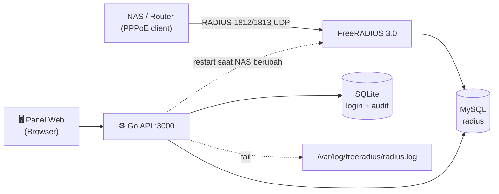

<div align="center">

# minimalFreeRadius

**FreeRADIUS + MySQL dengan REST API Go dan panel web untuk manajemen NAS & user PPPoE.**

[](https://opensource.org/licenses/MIT)
[](https://go.dev/)
[](https://svelte.dev/)
[](https://www.mysql.com/)
[](https://freeradius.org/)
[](https://ubuntu.com/)

</div>

---

## ✨ Fitur

| | |
|---|---|
| 📡 **FreeRADIUS 3.0** | Integrasi MySQL, SQL module, autentikasi PPPoE dari database |
| 🖥️ **Panel Web** | SvelteKit + shadcn-svelte: kelola user & NAS dari browser |
| 🔌 **REST API (Go)** | JWT + API Key, rate limiting, Swagger UI |
| 📜 **Live Radius Logs** | Tail `radius.log` realtime via SSE (Accept/Reject) |
| ❤️ **System Health** | CPU, RAM, disk, status FreeRADIUS, counter auth |
| 🗄️ **Audit Trail** | Login history & activity log tersimpan di SQLite |
| 🔥 **Installer otomatis** | `install.sh` (RADIUS) + `setup.sh` (API, systemd) |

## 🏗️ Arsitektur



## 📋 Prasyarat

- **OS**: Ubuntu 22.04 LTS (20.04 / Debian 11 kompatibel)
- **Hardware**: RAM ≥ 1 GB, disk ≥ 2 GB
- **Software**: root/sudo, MySQL 5.7+, Go 1.18+ dengan `gcc`/build-essential (CGO), systemd

## 🚀 Instalasi

Satu perintah, tanpa clone manual. Repo otomatis diambil ke
`/opt/minimalFreeRadius`, lalu `install.sh` memasang MySQL + FreeRADIUS +
schema, dan langsung menjalankan `freeradius-api/setup.sh` (Go API + panel web
+ systemd service):

```bash
curl -fsSL https://raw.githubusercontent.com/iamfafakkk/minimalFreeRadius/main/install.sh | sudo bash
```

Selesai. Panel tersedia di **`http://<server>:3000`** (login default `admin` / `admin123!`).

> Butuh: Ubuntu/Debian, akses root, dan koneksi internet. Go & Node.js
> dipasang otomatis dengan mengunduh **tarball resmi** dari `go.dev` dan
> `nodejs.org` (bukan dari repo Ubuntu).

<details>
<summary><b>Ubah lokasi / branch, atau jalankan dari repo lokal</b></summary>

<br>

```bash
# direktori atau branch lain
curl -fsSL https://raw.githubusercontent.com/iamfafakkk/minimalFreeRadius/main/install.sh \
  | sudo INSTALL_DIR=/srv/minimalFreeRadius REPO_BRANCH=main bash

# sudah punya repo (git clone manual)
cd minimalFreeRadius
sudo ./install.sh
```

</details>

<details>
<summary><b>Opsi kedua script</b></summary>

<br>

| Script | Melakukan |
|---|---|
| `install.sh` | clone repo ke `/opt` (bila via curl), MySQL, FreeRADIUS + schema resmi, user testing, UFW (1812/1813 UDP), lalu menjalankan `setup.sh` |
| `setup.sh` | Build Go (CGO), build panel web, verifikasi schema, UFW port API, systemd service |

```bash
./setup.sh --check-only      # cek requirements saja
./setup.sh --build-only      # build binary saja
./setup.sh --db-only         # verifikasi schema database
sudo ./setup.sh --systemd-only    # build + install service
sudo ./setup.sh --no-start        # install tanpa start
sudo ./setup.sh --remove-systemd  # hapus service
```

</details>

### 📦 Install dari Release

Setiap rilis punya tag (mis. `v1.0.0`) dengan arsip source siap pakai.

```bash
# Unduh arsip rilis terbaru (ganti VERSION bila perlu)
VERSION=v1.0.0
curl -L -o minimalFreeRadius.tar.gz \
  https://github.com/iamfafakkk/minimalFreeRadius/archive/refs/tags/${VERSION}.tar.gz
tar -xzf minimalFreeRadius.tar.gz
cd minimalFreeRadius-${VERSION#v}

sudo ./install.sh
```

Atau lewat git, langsung di tag rilis:

```bash
git clone --branch v1.0.0 --depth 1 \
  https://github.com/iamfafakkk/minimalFreeRadius.git
```

> Lihat semua rilis & catatan perubahan di
> [Releases](https://github.com/iamfafakkk/minimalFreeRadius/releases).

## 🧩 Panel Web

| Halaman | Fungsi |
|---|---|
| `/dashboard` | Ringkasan: total NAS, user, status database |
| `/dashboard/users` | CRUD user PPPoE (password + profile) |
| `/dashboard/nas` | CRUD NAS + test CoA/auth |
| `/dashboard/radius-logs` | Realtime Accept/Reject (SSE) |
| `/dashboard/logs` | Login history & activity audit |
| `/dashboard/system` | System health |

## 🔌 REST API

Base URL: `http://localhost:3000/api/v1` · Swagger UI: `/api-docs`

```bash
# Health & login
curl http://localhost:3000/api/v1/auth/health
TOKEN=$(curl -s -X POST http://localhost:3000/api/v1/auth/login \
  -H 'Content-Type: application/json' \
  -d '{"username":"admin","password":"admin123!"}' | jq -r .data.token)

# Tambah user PPPoE
curl -X POST http://localhost:3000/api/v1/users \
  -H "Authorization: Bearer $TOKEN" -H 'Content-Type: application/json' \
  -d '{"user":"budi@dsnet","password":"rahasia","profile":"500M"}'

# Tambah NAS
curl -X POST http://localhost:3000/api/v1/nas \
  -H "Authorization: Bearer $TOKEN" -H 'Content-Type: application/json' \
  -d '{"name":"router1","ip":"10.20.10.2","secret":"dsnet354","type":"mikrotik"}'
```

<details>
<summary><b>Semua endpoint</b></summary>

<br>

| Method | Endpoint | Keterangan |
|---|---|---|
| GET | `/auth/health` | Health check (publik) |
| POST | `/auth/login` | Login panel → cookie sesi |
| GET | `/nas` · `/nas/stats` | Daftar NAS · statistik |
| POST | `/nas` | Buat NAS (auto restart FreeRADIUS) |
| PUT · DELETE | `/nas/{id}` | Update · hapus NAS |
| POST | `/nas/{id}/test` | Test CoA/disconnect |
| POST | `/nas/test-auth` | Test autentikasi |
| GET | `/users` · `/users/stats` | Daftar user · statistik |
| POST | `/users` | Buat user (radcheck + radreply) |
| PUT · DELETE | `/users/{username}` | Update · hapus user |
| GET | `/radius/log` · `/radius/log/stream` | Log terakhir · stream SSE |
| GET | `/system/health` | Health server lengkap |
| GET | `/system/users` · `/system/login-history` · `/system/activity` | Audit |

</details>

## ⚙️ Konfigurasi

Edit `freeradius-api/.env` (dibuat otomatis dari `.env.example`):

```env
DB_HOST=localhost
DB_NAME=radius
DB_USER=radius
DB_PASSWORD=radiuspass123!     # ganti di production
JWT_SECRET=<auto-generated>
ADMIN_USERNAME=admin
ADMIN_PASSWORD=admin123!        # ganti di production
PORT=3000
RADIUS_LOG=/var/log/freeradius/radius.log
FREERADIUS_RELOAD_CMD=systemctl restart freeradius   # kosongkan untuk menonaktifkan
```

## 🛠️ Manajemen Service

```bash
sudo systemctl status freeradius-api
sudo systemctl restart freeradius-api
journalctl -u freeradius-api -f
sudo systemctl restart freeradius        # FreeRADIUS
```

<details>
<summary><b>Troubleshooting</b></summary>

<br>

| Gejala | Cek |
|---|---|
| API tidak jalan | `journalctl -u freeradius-api -n 50` |
| Panel kosong / API-only | build panel: `cd freeradius-web && npm install && npm run build` |
| Login NAS gagal | `sudo freeradius -XC`, secret & IP client di tabel `nas` |
| Log Accept/Reject kosong | `log { auth = yes }` di `/etc/freeradius/3.0/radiusd.conf` |
| Port tidak listening | `sudo ss -tulnp \| grep -E '1812\|1813\|3000'` |
| NAS baru belum dikenali | `sudo systemctl restart freeradius` (client dibaca saat start) |

```bash
# Diagnostik cepat
sudo systemctl status freeradius mysql freeradius-api
mysql -u radius -p radius -e "SHOW TABLES;"
radtest testuser testpass localhost 0 testing123
```

</details>

## 📚 Dokumentasi

- [Panduan Instalasi API](freeradius-api/docs/INSTALLATION_GUIDE.md)
- [Dokumentasi API](freeradius-api/docs/API_DOCUMENTATION.md)
- [Cloudflare SSL](freeradius-api/docs/CLOUDFLARE_SSL_CONFIGURATION.md) · [Swagger](freeradius-api/docs/SWAGGER_GUIDE.md)
- [FreeRADIUS Wiki](https://wiki.freeradius.org/)

## 📄 Lisensi

MIT License — lihat [LICENSE](LICENSE). Komponen pihak ketiga memakai
lisensinya masing-masing (FreeRADIUS & MySQL: GPLv2; Swagger UI yang
di-vendor: Apache-2.0).

## 👤 Author

Farras Adytama — [@iamfafakkk](https://github.com/iamfafakkk)

---

⚠️ **Ganti semua password default sebelum dipakai di production.**
